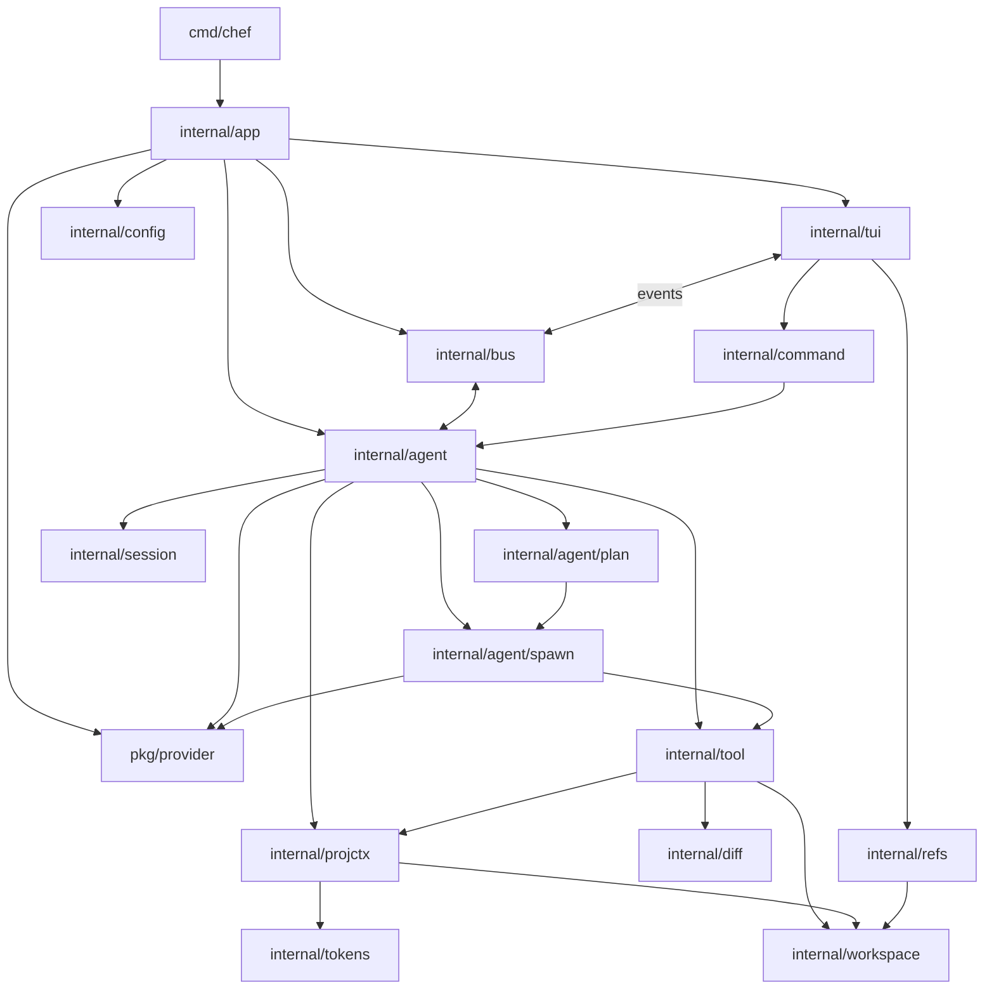

# chef

> A minimal, opinionated AI coding agent that always knows your codebase.

Chef is a terminal coding agent written in **Go** with a TUI built on the [Charm](https://charm.sh) stack. It's built to do one thing well — **give the agent maximum code-related context from the first turn** — and it's extensible enough for users to add new capabilities when they need them.

Unlike tools that give you a blank canvas and say "build your own workflow," chef ships with carefully designed built-in features — **plan mode**, **mini-agents**, and a **structured context system** — and it's opinionated about how they work.

---

## The Problem Chef Solves

Every coding session starts with context loss. The agent doesn't know what files do, what terms your project uses, or where features live. You waste tokens and time describing things that already exist — just scattered across code comments, documentation, and your own memory.

Chef solves this by maintaining a set of **project context files** in your source tree, read by a **dedicated `context` tool** that queries, maintains, and injects this knowledge into every session. The agent knows your project before you type a word.

```
Session starts → Context tool injects project knowledge → Agent already knows:
  ✓ What every file does
  ✓ Your domain terminology
  ✓ Where features and components live
  ✓ Architecture, data models, and API surface
  ✓ Build, test, and deploy workflows
  ✓ Coding conventions

Context drift detected → Context manager mini-agent spawned → Maintains files automatically
Non-trivial task → Plan mode → Sub-agents spawned in parallel → Main agent orchestrates
```

---

## Project Context System

This is chef's core differentiator. Up to eight compacted files in your source tree, managed by a **context manager mini-agent** — a focused agent spawned by the same system that powers sub-agents. The main agent queries context through the `context` tool, but maintenance and summarization are delegated to a dedicated mini-agent with its own system prompt, scoped tools, and defined task.

### The Context Files

| File | Purpose | Example |
|------|---------|---------|
| `.chef/project.md` | File/directory map — what each path does | `cmd/chef/main.go — CLI entrypoint, flag parsing, program init` |
| `.chef/glossary.md` | Domain terms and abbreviations | `SDD — Spec-Driven Development. Plan-then-execute against SPEC.md` |
| `.chef/features.md` | Feature and component inventory | `TUI rendering — internal/tui/view.go (render func)` |
| `.chef/conventions.md` | Coding standards and patterns | `Error handling: fmt.Errorf with %w wrapping, no panic` |
| `.chef/architecture.md` | System architecture and dependencies | `bubbletea (TUI) → agent runner → tool registry → provider` |
| `.chef/data.md` | Data models, schemas, DB structure | `Session { id: UUID, parentId: UUID?, role: string, content: []MessagePart }` |
| `.chef/api.md` | API surface, routes, public interfaces | `POST /v1/completions — stream agent responses as SSE` |
| `.chef/workflows.md` | Build, test, deploy, run commands | `Build: go build ./... Test: go test ./... Lint: golangci-lint run` |

Not every project needs all eight. Chef only generates the files that are applicable — `api.md` is skipped for a CLI-only project, for example. The eight files represent a **maximum**; most projects will use a subset.

### Context Budget

Every file has a hard token cap. Budget is estimated using **character count ÷ 4** (1 token ≈ 4 chars). The budget is enforced by the `context` tool, not the agent's judgment:

| File | Max tokens |
|------|------------|
| `project.md` | 2,000 |
| `glossary.md` | 1,000 |
| `features.md` | 1,500 |
| `conventions.md` | 1,000 |
| `architecture.md` | 1,500 |
| `data.md` | 1,500 |
| `api.md` | 1,500 |
| `workflows.md` | 500 |
| **Total** | **~10,500** |

Budget usage is displayed in the TUI footer. The goal: distill an entire codebase into ~10k tokens of dense signal so the agent skips exploration and starts working.

### Context Is a Live Shared Resource

`.chef/*.md` files live on disk and are shared across all sessions. If one agent is working on feature X and updates context, another session working on feature Y sees the changes immediately. Context is **never session-local** — it's the project's living knowledge base.

---

## Context Initialization

When chef detects no `.chef/` directory in a project, it offers to bootstrap context from the codebase. Available via `chef --init` or a TUI prompt on first run.

### The Init Flow

1. **Scan** — The main agent walks the project tree to understand the codebase layout
2. **Decide** — The main agent decides whether to handle init inline or delegate to mini-agents based on codebase size and structure
3. **Delegate** — One mini-agent per top-level directory. Each reads files in its region and produces entries for applicable context files (project.md, features.md, conventions.md, etc.)
4. **Review (main agent)** — The main agent reviews all generated entries for completeness, consistency, and budget compliance
5. **Review (user)** — The user reviews generated files one at a time: **Approve**, **Retry** (re-generate), or **Skip file**. No inline editing (reserved for future neovim integration)
6. **Commit** — Approved files are written to `.chef/`

### Init TUI Phases

**Progress phase** — parallel mini-agent work shown as a progress view:

```
─────────────────────────────────────────────────
  Initializing project context...

  ✦ internal/tools/      ✓  (4 files summarized)
  ✦ internal/tui/        ⠋  (running)
  ✦ internal/agent/      ⠋  (running)
  ✦ pkg/provider/        ⏳  (queued)

  Press Esc to cancel
─────────────────────────────────────────────────
```

**Review phase** — per-file paging:

```
─────────────────────────────────────────────────
  .chef/project.md       [1/5 files]

  cmd/chef/main.go  —  CLI entrypoint, flag parsing...
  internal/tui/app.go  —  tea.Program, top-level Model...
  ...

  [Approve]  [Retry]  [Skip file]
  ← prev  |  next →
─────────────────────────────────────────────────
```

After review, the normal chat session starts with context already injected.

### Full Rebuild

Run `/context rebuild` to rerun the full init flow at any time — full scan, multi-agent partitioning, and user review.

---

## Context Maintenance

Two modes: **normal maintenance** (background, auto-applied) and **full rebuild** (deliberate, user-reviewed).

### Normal Maintenance

Triggered in two cases:

1. **After plan execution** — auto-spawns context manager in background to scan for drift
2. **On session start** — if drift is detected, context manager runs in background. The session starts immediately with existing context — it doesn't wait.
3. **Manual** — `/context refresh` spawns context manager on demand

During normal maintenance, the context manager:
- Runs `context scan` → identifies new/removed/changed files
- Reads changed files → `context update` entries into affected `.md` files
- `context remove` for deleted paths
- `context compact` if budgets are tight

All changes are **applied directly** — no review gate. A summary is shown in the message log when complete:

```
Context manager completed (3s, $0.02)
  + 4 new entries in project.md (internal/tools/new_tool.go, ...)
  + 2 new entries in features.md
  - 1 removed entry in project.md (internal/old_module/*)
  ~ 1 compacted entry in glossary.md (980→720 tokens)
  Budget: 6,240 / 10,500 tokens (59%)
```

All background work is **visible in the TUI** via sub-agent progress widgets — nothing happens silently.

---

## The `context` Tool

The `context` tool provides structured, budget-aware operations on project context files. Writes to `.chef/*.md` are **locked to the context tool only** — the `write` tool rejects paths under `.chef/`.

### Operations

| Operation | Who uses it | Description |
|-----------|-------------|-------------|
| `context query "<topic>"` | Main agent, mini-agents | Search all context files. Returns compacted results with source attribution. |
| `context scan` | Main agent | Walk project tree, compare against `project.md`, report drift (new/removed/changed files). |
| `context update <file> "<entry>"` | Main agent, context manager | Keyed upsert. Validates token budget — rejects on overflow. Uses per-file `sync.Mutex` for write ordering. |
| `context compact <file>` | Context manager | Summarize a context file further within budget. Uses a **priority hot path** in the context manager so compaction isn't blocked by other tasks. |
| `context remove <file> "<pattern>"` | Context manager | Remove entries matching a pattern (e.g., deleted files). |
| `context budget` | Any | Show token usage per file and total remaining. |

### How It Works

**Session start:** All `.chef/*.md` files that exist are loaded and injected into the system prompt as a structured preamble with source attribution.

**During work:** The agent uses `context query` for lookups and `context scan` to detect drift. Simple updates (`context update`) happen inline. When summarization or compaction is needed — heavy operations that benefit from focused LLM attention — a **context manager mini-agent** is spawned.

**Budget enforcement:** `context update` counts the resulting token cost in the tool layer. If the file would overflow its cap, the call is rejected with the current usage and a suggestion to compact. No agent can silently bloat context.

---

## Built-In Features

Chef ships with these features built in. They're first-class, well-designed parts of the core.

### Plan Mode

For non-trivial changes, chef generates a structured plan you review before any code is touched.

```bash
chef --plan "Add grep tool with regex support"
```

The flow:

1. **Analyze** — Reads relevant context files and code via the `context` tool
2. **Plan** — Generates structured steps with explicit dependencies (DAG, not just a list)
3. **Review** — Conversational review. The user views the plan and requests changes through natural language — reordering, adding steps, modifying, deleting. No UI form editing.
4. **Execute** — DAG-based execution. Parallelizable steps (no dependency overlap) are delegated to sub-agents. Dependent steps wait.
5. **Verify** — Runs tests or checks to confirm correctness

#### Plan Step Structure

Each step carries:

```
Step {
  id: "step-3"
  description: "Add grep tool with regex support"
  files: ["internal/tools/grep.go"]        // affected files
  dependsOn: ["step-1"]                    // explicit dependencies
  status: pending | running | done | failed | skipped
  assignedTo: "main" | "sub-agent-A"      // execution target
  output: string                           // result/diff after execution
}
```

The plan is stored as JSON with the session and is fully resumable — already-completed steps are not re-executed.

#### Step Failure

When a step fails:
1. **Retry once** automatically
2. If still failing, **pause the plan** and prompt the user:

```
Step 3 failed after 2 attempts.
Error: "cannot find symbol 'RegexMatcher' in internal/tools/types.go"

What would you like to do?
  [R]etry again   [S]kip step   [E]dit plan   [C]ancel plan
  Or type a message for the agent...
```

The user can type natural language to modify the step, add setup steps, or take any action through the agent. Execution resumes from the paused point.

#### Plan Mode UI

During execution, the message log shows:

```
Executing plan "Add grep tool" (8 steps)

  ✓ Step 1: Create types definition        (main agent, 12s)
  ✓ Step 2: Implement grep logic           (sub-agent A, 28s)
  ⠋ Step 3: Add to tool registry           (sub-agent B, running)
  ⏳ Step 4: Update project.md              (waiting on step 3)
  ...
```

### Mini-Agents

Chef can spawn focused mini-agents that run with their own system prompt, scoped tool access, and defined task. The main agent orchestrates, reviews results, and merges changes. This is the same mechanism used for **parallel work sub-agents**, the **context manager**, and **context init agents**.

#### How Mini-Agents Work

Every mini-agent is spawned with:

- **System prompt** — A focused prompt tailored to the task
- **Context injection** — Selected `.chef/*.md` files pre-loaded into its context window
- **Tool scope** — A subset of tools relevant to the task
- **Task** — A concrete description of what to accomplish
- **Model** — Uses the configured **light model** by default (falls back to main model if not configured). Thinking mode and model are configurable per-spawn.
- **Timeout** — Configurable per-agent timeout (default: 5 minutes). On timeout, the LLM stream is cancelled and a timeout error is returned.

The mini-agent runs in a background goroutine, makes tool calls, and returns its results (output, file diffs, context updates) to the main agent.

#### Two-Model Design

Chef is designed around two models: a **main model** for the primary agent and a **light model** for mini-agents (init agents, context manager, work sub-agents).

```json
{
  "provider": "anthropic",
  "model": "claude-sonnet-4-20250514",
  "light": {
    "provider": "openai",
    "model": "gpt-4o-mini"
  }
}
```

The `light` config can override `provider` independently. If `light` isn't set, mini-agents fall back to the main model.

#### Work Sub-Agents

When plan mode detects parallelizable work, chef spawns sub-agents that each take a slice:

```
Task: "Refactor the internal packages"

  Sub-agent A → Refactor internal/tools/  (tools: read/edit/write/bash)
  Sub-agent B → Refactor internal/tui/    (tools: read/edit/write/bash)
  Main agent   → Orchestrate, review diffs, merge
```

Each sub-agent gets the same context injection as the main agent. Results are collected, the main agent checks for correctness against the plan step, and diffs are presented before any changes are applied.

#### Context Manager Mini-Agent

The context manager is a mini-agent specialized for maintaining `.chef/*.md` files. It uses a **priority task queue** — `high` priority for compaction (budget is about to breach), `normal` for updates and removals. Compaction always drains before other tasks.

It gets a focused tool set (`read`, `grep`, `find`, `ls`, `context`) and runs on the light model by default.

```
Context manager spawned after /context refresh:

  1. context scan → finds 3 new files, 1 deleted
  2. read internal/tools/grep.go → summarize → context update project
  3. read internal/tools/grep.go → summarize → context update features
  4. context remove project "internal/old_module/*" → deleted dir removed
  5. context compact glossary → was 980/1000, now 720/1000
```

#### Unified Spawning System

There is one spawning mechanism. The difference between agent roles is only configuration:

| Aspect | Work sub-agent | Context manager | Init agent |
|--------|---------------|-----------------|------------|
| System prompt | Task-specific instructions | Summarization/maintenance instructions | Bootstrap/scan instructions |
| Tools | read/edit/write/bash/context | read/grep/find/ls/context | read/grep/find/ls/context |
| Scope | A subset of the codebase | All `.chef/*.md` files | One top-level directory |
| Model | Light (default) | Light (default) | Light (default) |
| Thinking | Configurable | Configurable | Configurable |
| Trigger | Plan execution | Drift, session start, manual | `chef --init` / first-run prompt |

#### Mini-Agent Concurrency

Configurable max concurrent mini-agents with a reasonable default. The spawner routes model selection, enforces concurrency limits, handles priority queuing (for context manager), and collects results.

#### Failure Handling

- **Timeout** (default 5m): cancel stream, terminate goroutine, report to main agent
- **LLM failure**: retry once, then report to main agent
- **Tool failure**: handled inline by the mini-agent (same as main agent behavior)
- **Batch failure**: if all agents in a batch fail, the main agent detects and surfaces the root cause
- **Invalid output**: the main agent validates results (e.g., well-formed context entries, applicable diffs) before accepting

### Slash Commands

| Command | Description |
|---------|-------------|
| `/plan <prompt>` | Enter plan mode |
| `/context query "<topic>"` | Search context files |
| `/context scan` | Detect project changes vs context |
| `/context budget` | Show token budget usage |
| `/context refresh` | Spawn context manager to update all files |
| `/context rebuild` | Full re-scan: rerun entire init flow with user review |
| `/session` | Show session info |
| `/resume` | Browse past sessions |
| `/new` | Start new session |
| `/model` | Switch model |
| `/quit` | Exit |

Slash commands can be used **anywhere** in the input — they don't need to be the first word.

### `@` File References

Type `@` in the input editor to attach file contents directly to your prompt:

- `@internal/tools/grep.go` — attach full file
- `@internal/tools/grep.go:10-30` — attach a line range
- `@internal/tools/` — attach all files in a directory (within per-attachment budget)
- `@project`, `@features`, `@conventions`, etc. — attach context files by name

The TUI shows completion suggestions as you type. If content exceeds ~2000 tokens, a truncation warning is shown and you can narrow with line ranges.

---

## Architecture

```
┌─────────────────────────────────────────────┐
│                   TUI                        │
│          (bubbletea + lipgloss + bubbles)    │
│                                             │
│  ┌───────────────┐  ┌───────────────────┐   │
│  │  Message Log   │  │    Input Editor   │   │
│  └───────────────┘  └───────────────────┘   │
│  ┌───────────────────────────────────────┐   │
│  │            Footer (stats)             │   │
│  └───────────────────────────────────────┘   │
├─────────────────────────────────────────────┤
│              Agent Core                      │
│  ┌──────────────┐  ┌────────────────────┐   │
│  │  Runner       │  │  Plan Engine       │   │
│  └──────────────┘  └────────────────────┘   │
│  ┌──────────────┐  ┌────────────────────┐   │
│  │  Mini-agent  │  │  Context Tool      │   │
│  │  Spawner     │  │  (query/update/   │   │
│  │  (work + ctx │  │   scan/compact)    │   │
│  │   mgr + init) │  └────────────────────┘   │
│  └──────────────┘                            │
│  ┌──────────────┐  ┌────────────────────┐   │
│  │  Session     │  │  Compactor         │   │
│  │  Manager     │  │  (auto-compact)    │   │
│  └──────────────┘  └────────────────────┘   │
├─────────────────────────────────────────────┤
│               Tool Registry                   │
│  read │ write │ edit │ bash │ grep │ find │ │
│  ls  │ context │ diff                               │
├─────────────────────────────────────────────┤
│           Provider / Model Layer             │
│  OpenAI (primary) │ Anthropic │ Custom       │
└─────────────────────────────────────────────┘
```

## Project Structure

Chef is organized as a set of deep, single-purpose packages. Each package owns one domain — tools own tool execution, `projctx` owns `.chef/*.md` files, `bus` owns the agent↔TUI seam — and exposes a small interface so subsystems can be swapped or extended without reshaping callers.

```
chef/
├── cmd/chef/                         # binary entrypoint
│   ├── main.go                       # subcommand dispatch + flag parsing → app.Run
│   └── flags.go                      # CLI flag definitions
├── internal/
│   ├── cli/                          # CLI subcommands
│   │   ├── cli.go                    # subcommand registry + dispatch
│   │   └── config.go                 # chef config setup wizard
│   ├── app/                          # top-level wiring / DI
│   │   ├── app.go                    # Run(progName, flags)
│   │   └── boot.go                   # config → provider → tools → agent → tui
│   ├── tui/                          # Charm-based TUI (single package)
│   │   ├── app.go                    # tea.Program, top-level Model
│   │   ├── view.go                   # render → string
│   │   ├── input.go                  # textarea editor
│   │   ├── log.go                    # scrollable message log
│   │   ├── message.go                # role/message types
│   │   ├── styles.go                 # lipgloss theme
│   │   ├── header.go                 # session/model/plan indicator
│   │   ├── footer.go                 # budget bar, tokens, cwd, model
│   │   ├── plan.go                   # plan mode UI (review/execute/failure)
│   │   ├── agents.go                 # mini-agent progress widget
│   │   ├── init.go                   # context init progress + review
│   │   ├── review.go                 # generic Approve/Retry/Skip pager
│   │   ├── thinking.go               # collapsible thinking blocks
│   │   ├── refs.go                   # @ file completion popup
│   │   ├── commands.go               # / command completion popup
│   │   └── events.go                 # tea.Msg types from the agent
│   ├── agent/                        # agent core
│   │   ├── agent.go                  # Agent type + lifecycle
│   │   ├── turn.go                   # prompt → tools → reply for one turn
│   │   ├── stream.go                 # consume provider stream events
│   │   ├── compact.go                # session auto-compaction
│   │   ├── merge.go                  # collect & validate sub-agent diffs
│   │   ├── role.go                   # mini-agent role configs
│   │   ├── prompt.go                 # main + plan-generation system prompts
│   │   ├── plan/                     # plan engine subpackage
│   │   │   ├── plan.go               # Plan, Step, Status
│   │   │   ├── dag.go                # dependency DAG, parallel groups
│   │   │   ├── generate.go           # LLM-driven plan generation
│   │   │   ├── execute.go            # DAG execution + sub-agent dispatch
│   │   │   ├── review.go             # conversational plan review
│   │   │   └── failure.go            # retry / pause / user-choice
│   │   └── spawn/                    # mini-agent spawning subpackage
│   │       ├── spawn.go              # Spawner + Spec
│   │       ├── pool.go               # concurrency limiter
│   │       ├── queue.go              # priority queue (high=compact)
│   │       ├── handle.go             # AgentHandle (status/output/cancel)
│   │       └── timeout.go            # per-agent timeout + cancellation
│   ├── tool/                         # tool registry + built-in tools
│   │   ├── tool.go                   # Tool interface, Call, Result
│   │   ├── registry.go               # Registry + allowlist enforcement
│   │   ├── read.go / write.go / edit.go
│   │   ├── bash.go / bash_safety.go  # blocklist + confirmation
│   │   ├── grep.go / find.go / ls.go / diff.go
│   │   └── context.go                # delegates to projctx
│   ├── projctx/                      # .chef/*.md project context system
│   │   ├── projctx.go                # Manager type
│   │   ├── files.go                  # 8 known files + per-file budgets
│   │   ├── parse.go / render.go      # markdown ↔ entries
│   │   ├── store.go                  # disk I/O, per-file sync.Mutex
│   │   ├── budget.go                 # token budget enforcement
│   │   ├── query.go                  # cross-file search w/ attribution
│   │   ├── scan.go                   # drift detection vs project.md
│   │   ├── update.go / remove.go     # keyed upsert + pattern remove
│   │   ├── compact.go                # compaction trigger
│   │   └── inject.go                 # session preamble builder
│   ├── session/                      # JSONL persistence + tree
│   │   ├── session.go                # Session, Message, Part
│   │   ├── store.go                  # JSONL load/save
│   │   ├── tree.go                   # parent/child + fork
│   │   ├── resume.go                 # -c / -r / --session
│   │   └── id.go                     # ID generation
│   ├── config/                       # JSON config (global + project)
│   │   ├── config.go / defaults.go
│   │   ├── load.go / merge.go / write.go
│   │   └── validate.go / errors.go
│   ├── command/                      # slash commands (parsed anywhere)
│   │   ├── command.go / registry.go / parse.go
│   │   └── plan.go / context.go / session.go / meta.go
│   ├── refs/                         # @ file references
│   │   └── refs.go / parse.go / attach.go / complete.go
│   ├── workspace/                    # filesystem + path safety
│   │   ├── workspace.go / walk.go / gitignore.go
│   │   ├── path.go                   # normalization
│   │   ├── safety.go                 # blocks .chef/ + session writes
│   │   └── binary.go                 # binary file detection
│   ├── diff/                         # used by `diff` tool
│   │   ├── diff.go / git.go
│   │   └── tracker.go                # last-edit diff tracker
│   ├── tokens/                       # token counting (chars/4)
│   │   └── tokens.go / estimate.go
│   └── bus/                          # agent ↔ tui event bus
│       └── bus.go / events.go
├── pkg/                              # public API
│   └── provider/                     # LLM provider abstraction
│       ├── provider.go               # Provider, LightProvider
│       ├── message.go                # Message, Part, Role
│       ├── tool.go                   # ToolDef, ToolCall, ToolResult
│       ├── stream.go                 # StreamEvent variants
│       ├── thinking.go               # Thinking config
│       ├── registry.go               # provider registry
│       ├── openai/openai.go
│       └── anthropic/anthropic.go
├── go.mod
└── go.sum
```

### Module dependency graph



### Package responsibilities

| Package | Responsibility |
|---------|----------------|
| `cmd/chef` | Binary entrypoint, subcommand dispatch, flag parsing |
| `internal/cli` | CLI subcommands (`chef config`, etc.) |
| `internal/app` | Wires every subsystem; owns `Run` |
| `internal/tui` | All Charm-based presentation |
| `internal/agent` | Main agent loop, turn handling, compaction, merge |
| `internal/agent/plan` | Plan generation, DAG, execution, failure handling |
| `internal/agent/spawn` | Unified mini-agent spawner with pool + priority queue |
| `internal/tool` | Tool interface, registry, built-in tool implementations |
| `internal/projctx` | `.chef/*.md` operations (query/scan/update/compact/inject) |
| `internal/session` | JSONL session persistence with tree branching |
| `internal/config` | Layered JSON config (global + project) |
| `internal/command` | Slash command parsing and dispatch |
| `internal/refs` | `@` file reference parsing, attachment, completion |
| `internal/workspace` | Path normalization, gitignore, write safety |
| `internal/diff` | Git diff + last-edit tracker for `diff` tool |
| `internal/tokens` | Token estimation (chars/4) |
| `internal/bus` | Async agent → synchronous TUI event bus |
| `pkg/provider` | Public LLM provider abstraction (extensible) |

## Configuration

Chef requires a **global config file** before the TUI will start. Run the setup wizard on first use:

```bash
chef config              # write ~/.chef/config.json
chef config --project    # write .chef/config.json in the current git repo
```

The wizard prompts for provider (OpenAI, Anthropic, or a custom OpenAI-compatible endpoint), model, thinking level, theme, and an optional light model for mini-agents. API keys are **not** stored in config — each provider uses an `apiKeyEnv` field naming the environment variable to read (e.g. `OPENAI_API_KEY`, `ANTHROPIC_API_KEY`, `CUSTOM_API_KEY`).

If you launch chef without a global config, it exits with a message pointing you to `chef config`.

JSON only. Two locations (project overrides global):

| Path | Scope |
|------|-------|
| `~/.chef/config.json` | Global defaults |
| `.chef/config.json` | Project-specific |

```json
{
  "provider": "openai",
  "model": "gpt-4o",
  "providers": {
    "openai": { "apiKeyEnv": "OPENAI_API_KEY" },
    "anthropic": {
      "apiKeyEnv": "ANTHROPIC_API_KEY",
      "baseURL": "https://api.anthropic.com",
      "version": "2023-06-01",
      "beta": ["prompt-caching-2024-07-31"],
      "timeout": "60s",
      "maxRetries": 2
    },
    "custom": {
      "baseURL": "https://my-host/v1",
      "apiKeyEnv": "MY_API_KEY",
      "headers": { "X-Extra": "v" },
      "timeout": "60s",
      "maxRetries": 2
    }
  },
  "light": {
    "provider": "openai",
    "model": "gpt-4o-mini"
  },
  "thinking": "medium",
  "sampling": { "temperature": 0.2, "topP": 1.0, "topK": 0, "maxTokens": 4096 },
  "maxTurns": 50,
  "tools": ["read", "write", "edit", "bash", "grep", "find", "ls", "context", "diff"],
  "maxConcurrentAgents": 4,
  "agentTimeout": "5m",
  "contextFiles": {
    "dir": ".chef",
    "budget": {
      "project.md": 2000,
      "glossary.md": 1000,
      "features.md": 1500,
      "conventions.md": 1000,
      "architecture.md": 1500,
      "data.md": 1500,
      "api.md": 1500,
      "workflows.md": 500
    }
  },
  "session": {
    "dir": "~/.chef/sessions",
    "autoCompact": true,
    "compactThreshold": 0.8,
    "compactMaxTurns": 50
  },
  "bash": {
    "blocklist": ["rm -rf /", "mkfs", "dd if=", "shutdown", "reboot"]
  },
  "theme": "dark"
}
```

## The TUI

From top to bottom:

- **Header** — Session name, model, active plan (if in plan mode)
- **Message Log** — Scrollable conversation with user prompts, assistant responses, tool calls/results, sub-agent progress, and collapsible thinking blocks
- **Input Editor** — Multi-line input with `@` file references and `/` commands
- **Footer** — Working directory, context budget usage (`████░░ 78%`), token/cost stats, current model

### Sub-Agent UI

Active sub-agents shown as a widget above the input. All background work (context manager, init agents, plan sub-agents) is visible here — nothing runs silently:

- Per-agent task description and status
- Progress with current step and tool calls in flight
- Collapsible output per agent
- Merge status on completion

### Thinking Output

Model thinking is shown as a **collapsible** block in the message log. Default is collapsed — click to expand and see the reasoning.

### Error Display

Errors (rate limits, API failures, timeouts) are shown clearly in the message log. No silent auto-retries — the user always sees what happened.

---

## Tools

| Tool | Description |
|------|-------------|
| `read` | Read file contents (text + images). Rejects unknown binary files. Respects `.gitignore`. |
| `write` | Create or overwrite files. Rejects writes to `.chef/` and session dirs. Rejects binary paths. |
| `edit` | Precise text replacement with exact matching. **Fails if file doesn't exist** (use `write` first). Suggests `write` if `oldText` exceeds 80% of file size. |
| `bash` | Execute shell commands. Dangerous commands (from configurable blocklist) require explicit user confirmation. |
| `grep` | Search file contents by regex. Respects `.gitignore`. |
| `find` | Find files by glob pattern. Respects `.gitignore`. |
| `ls` | List directory contents. Respects `.gitignore`. |
| `diff` | Show file changes. `diff` / `diff path` for git diff (uncommitted). `diff --last path` for last-edit diff (tracked by the tool layer, works without git). `diff --all` for all uncommitted changes across the project. |
| `context` | Query, scan, update, and compact project context files. |

### Edit Conflict Resolution

The `edit` tool uses exact string matching — if the file content changed since the agent last read it, the match fails and the agent re-reads and retries. This handles concurrent edits from multiple sessions or sub-agents naturally. No explicit locking required.

### Path Restrictions

- `write` and `edit` are **blocked** from writing to `.chef/` (context writes go through the `context` tool only)
- `write` and `edit` are **blocked** from writing to session directories (`~/.chef/sessions/`)
- `write` rejects binary file paths (`.png`, `.svg`, `.woff2`, etc.)
- `read` rejects unknown binary files (images are supported: jpg, png, gif, webp)

---

## Sessions

JSONL files with tree structure (`id` + `parentId`). Auto-saved to `~/.chef/sessions/` by working directory. Multiple concurrent sessions in the same project are fully supported — they share context files and use independent session files.

- Continue: `chef -c`
- Browse: `chef -r`
- Fork/branch without file duplication (messages inherited through parent chain)

### Resume

When resuming with `chef -c`, the session injects the **final compaction summary** as preamble so the agent remembers where it left off, and pulls in the **latest `.chef/*.md` context** from disk.

### Auto-Compaction

Session history is auto-compacted when either threshold is reached (whichever comes first):

- **Token threshold** — context usage hits `compactThreshold` (default 80% of context window)
- **Turn threshold** — conversation exceeds `compactMaxTurns` (default 50 turns)

When compaction fires, the oldest messages are summarized into a dense summary block. The user sees a summary of what was compressed. On session end, a final summary is always stored with the session file for quick resume.

---

## CLI Reference

```bash
chef [options] [message...]
chef config [--project]
```

### Commands

| Command | Description |
|---------|-------------|
| `config` | Interactive setup wizard for global or project config |

#### `chef config`

| Flag | Description |
|------|-------------|
| `--project` | Write to `.chef/config.json` in the current git repo instead of global config |
| `-h`, `--help` | Show config command help |

### Options

| Flag | Description |
|------|-------------|
| `--init` | Initialize project context (also prompted on first run in new projects) |
| `-c`, `--continue` | Continue most recent session |
| `-r`, `--resume` | Browse and select session |
| `--session <path>` | Specific session file |
| `--no-session` | Ephemeral mode |
| `--plan <prompt>` | Start in plan mode |
| `--model <name>` | Override model |
| `--provider <name>` | Override provider |
| `--thinking <level>` | `off`, `low`, `medium`, `high` |
| `-t`, `--tools <list>` | Comma-separated tool allowlist |
| `--no-tools` | Disable all tools |
| `--no-context` | Skip project context injection |
| `--verbose` | Verbose logging |
| `-v`, `--version` | Print version |
| `-h`, `--help` | Show help |

### Environment Variables

| Variable | Description |
|----------|-------------|
| `CHEF_DIR` | Override config directory (default: `~/.chef`) |
| `CHEF_OFFLINE` | Disable startup network calls |
| `ANTHROPIC_API_KEY` | Anthropic API key (when `providers.anthropic.apiKeyEnv` is unset) |
| `OPENAI_API_KEY` | OpenAI API key (when `providers.openai.apiKeyEnv` is unset) |
| *(custom)* | Set the env var named in `providers.custom.apiKeyEnv` (default wizard: `CUSTOM_API_KEY`) |

---

## Tech Stack

| Component | Choice |
|-----------|--------|
| Language | Go 1.23+ |
| TUI Framework | [bubbletea](https://github.com/charmbracelet/bubbletea) |
| Styling | [lipgloss](https://github.com/charmbracelet/lipgloss) |
| UI Components | [bubbles](https://github.com/charmbracelet/bubbles) |
| Config Wizard | [huh](https://github.com/charmbracelet/huh) |
| LLM Abstraction | [genai](https://github.com/charmbracelet/genai) |
| Config | JSON (encoding/json) |
| Sessions | JSONL with tree structure |
| Testing | `go test` + `tea.TestHelpers` |

## Development

```bash
git clone github.com/mythosmystery/chef
cd chef
go build ./cmd/chef
chef config    # first-time setup (creates ~/.chef/config.json)
./chef
go test ./...
go fmt ./...
```

## Philosophy

Chef was built to do one thing well: **give the AI agent maximum project context from the first turn so it can work immediately instead of exploring**.

Everything else flows from that:

- **Plan mode** — the agent uses context to think before acting. DAG-based execution with explicit dependencies, conversational review, and correctness-checked merges.
- **Mini-agents** — one spawning system handles everything. Work sub-agents, the context manager, and init agents are the same mechanism with different prompts, tool scopes, and tasks. Same engine, different roles.
- **Context tool** — structured, budget-enforced operations so project knowledge is maintained by design, not left to the agent's best effort with raw files. Live shared on-disk resource.
- **Two-model design** — main model for the primary agent, light model for mini-agents. Built from the start to minimize cost without sacrificing capability where it matters.

The core is opinionated about these workflows. But chef is extensible — the tool registry accepts new tools, the provider layer accepts new LLM backends, and users can add capabilities when they need them. The goal isn't to do everything, it's to do the important things well and leave room for the rest.

## License

MIT
